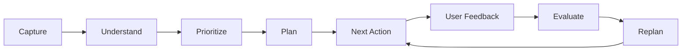
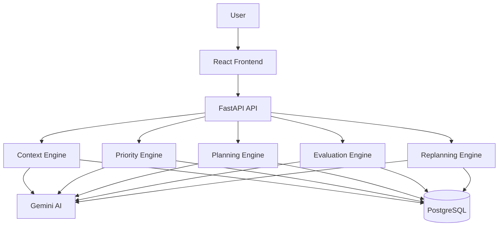

# 🧠 LifeOS

<p align="center">
  
</p>

<p align="center">
  <a href="#">
    
  </a>
  <a href="#">
    
  </a>
  <a href="#">
    
  </a>
</p>

<p align="center">
  
</p>

<p align="center">
  <strong>Give LifeOS your messy information. It tells you what matters and what to do next.</strong>
</p>

---

# 🌌 What Is LifeOS?

**LifeOS** is an AI-powered personal action system designed to transform scattered information into clear, prioritized and executable actions.

People have information everywhere:

- Notes
- Tasks
- Documents
- Deadlines
- Goals
- Ideas
- Study material
- Work requirements

The problem is not collecting information.

The real problem is:

> **What actually matters, what should I do next, and what happens when my plan changes?**

LifeOS is designed to solve that problem.

---

# ⚡ The Core Idea

Most productivity tools answer:

> **"What do I have to do?"**

LifeOS focuses on:

> **"What should I do next?"**

The product continuously moves through:

```text
INFORMATION
     ↓
UNDERSTAND
     ↓
PRIORITIZE
     ↓
PLAN
     ↓
ACT
     ↓
FEEDBACK
     ↓
REPLAN
     ↓
NEXT ACTION
```

This creates a continuous decision-making loop instead of another static task list.

---

# 🎯 The Problem

Modern users are overloaded with information.

A typical day can contain:

```text
Exam
Assignment
Meeting
Project
Deadline
Ideas
Emails
Notes
Personal Goals
```

The user still has to manually answer:

- What is urgent?
- What is important?
- What should I work on first?
- How much time will it take?
- Can everything fit today?
- What happens if I miss something?

Traditional productivity applications usually organize information.

**LifeOS attempts to turn that information into decisions and actions.**

---

# 💡 LifeOS Solution

```text
              SCATTERED INFORMATION
                       │
                       ▼
              ┌─────────────────┐
              │  AI CONTEXT     │
              │  UNDERSTANDING  │
              └────────┬────────┘
                       │
                       ▼
              ┌─────────────────┐
              │ PRIORITY ENGINE │
              └────────┬────────┘
                       │
                       ▼
              ┌─────────────────┐
              │  AI PLANNER     │
              └────────┬────────┘
                       │
                       ▼
              ┌─────────────────┐
              │  NEXT ACTION    │
              └────────┬────────┘
                       │
                       ▼
                     USER
                       │
                       ▼
                  FEEDBACK
                       │
                       ▼
                  REPLANNING
                       │
                       └──────────────► NEW PLAN
```

---

# 🧠 Core Product Workflow

LifeOS is built around one continuous loop:



The important part is the final loop.

LifeOS does not stop after generating a plan.

**The plan can change when reality changes.**

---

# ✨ Core Features

## 🧠 01 — AI Context Understanding

Users can provide unstructured information such as:

```text
I have an ML exam Friday.

I need to study Naive Bayes,
Linear Regression and Candidate Elimination.

My web assignment is due tomorrow
and it is 60% complete.

I have 3 hours tonight.
```

LifeOS converts this into structured context.

```text
GOAL
Prepare for ML exam

TASKS
Study Naive Bayes
Study Linear Regression
Study Candidate Elimination
Complete Web Assignment

DEADLINE
Web Assignment → Tomorrow
ML Exam → Friday

AVAILABLE TIME
3 Hours

PROGRESS
Assignment → 60% complete
```

---

# 🎯 02 — Intelligent Prioritization

LifeOS evaluates tasks using multiple signals:

- Deadline
- Urgency
- Importance
- Estimated effort
- Current progress
- Dependencies
- Available time
- Goal alignment

Instead of simply sorting tasks alphabetically or by creation date, LifeOS calculates what deserves attention first.

---

# ⚡ 03 — Next Best Action

This is the heart of LifeOS.

The user should never have to stare at a huge task list and ask:

> "Where do I start?"

LifeOS provides one recommended action.

```text
┌──────────────────────────────────────┐
│             NEXT ACTION              │
│                                      │
│      Complete Web Assignment         │
│                                      │
│      Priority: HIGH                  │
│      Estimated Time: 45 minutes      │
│                                      │
│      WHY THIS ACTION?                │
│                                      │
│      • Deadline is tomorrow          │
│      • Already 60% complete          │
│      • High urgency                  │
│      • Finishing it removes          │
│        immediate deadline pressure   │
│                                      │
│             [ START ]                │
└──────────────────────────────────────┘
```

The objective is simple:

> **Reduce decision fatigue.**

---

# 📅 04 — AI Action Planner

LifeOS converts priorities into a realistic plan.

Example:

```text
TODAY

6:00 PM
Complete Web Assignment
45 min

6:45 PM
Break
15 min

7:00 PM
Study Naive Bayes
45 min

7:45 PM
Practice Questions
30 min

8:15 PM
Review
30 min
```

The planner considers:

- Available time
- Task duration
- Deadlines
- Priority
- Dependencies
- Current progress
- Breaks

The objective is not to create a perfect-looking schedule.

The objective is to create a **realistic executable plan**.

---

# 🔄 05 — Adaptive Replanning

Plans rarely go exactly as expected.

Suppose the original plan is:

```text
Monday

Chapter 1
Chapter 2
Assignment
```

But the user completes only:

```text
Chapter 1
```

LifeOS can evaluate the new situation.

```text
Missed / Delayed Work
        ↓
Check Remaining Tasks
        ↓
Check Deadlines
        ↓
Recalculate Priorities
        ↓
Update Schedule
        ↓
Generate New Next Action
```

Example:

> Your assignment deadline is closer than Chapter 2, so LifeOS has moved Chapter 2 and prioritized the assignment.

This turns LifeOS from a static planner into an **adaptive action system**.

---

# 📊 06 — Progress Tracking

LifeOS tracks:

- Completed tasks
- Delayed tasks
- Missed tasks
- Partially completed tasks
- Goal progress
- Planning performance
- User feedback

The system can use this information when generating future plans.

---

# 🔍 07 — Explainable AI Decisions

LifeOS should never simply say:

> "Do this."

It should explain:

> **"Why this?"**

Example:

```text
WHY THIS TASK?

1. Closest deadline
2. High importance
3. Small remaining effort
4. Blocking another objective
5. Fits your available time
```

The goal is to make AI decisions understandable rather than mysterious.

---

# 📝 Example End-to-End Journey

### Step 1 — User Captures Information

```text
Exam Friday.
Assignment tomorrow.
Assignment 60% complete.
3 hours available tonight.
```

### Step 2 — LifeOS Understands

```text
Goal:
Prepare for exam

Urgent Task:
Complete assignment

Available:
3 hours
```

### Step 3 — LifeOS Prioritizes

```text
1. Complete Assignment
2. Study Naive Bayes
3. Study Linear Regression
4. Study Candidate Elimination
```

### Step 4 — LifeOS Plans

```text
Assignment → 45 min
Naive Bayes → 45 min
Practice → 30 min
Review → 30 min
```

### Step 5 — LifeOS Recommends

```text
NEXT ACTION

Complete the assignment.
```

### Step 6 — Reality Changes

```text
Assignment takes 90 minutes
instead of 45.
```

### Step 7 — LifeOS Replans

```text
Recalculate workload
        ↓
Protect deadline
        ↓
Move lower-priority work
        ↓
Generate updated plan
```

### Step 8 — New Next Action

```text
Continue studying Naive Bayes.
```

---

# 🏗️ AI Architecture



---

# 🤖 AI Components

## Context Engine

Responsible for:

- Information extraction
- Task detection
- Goal detection
- Deadline detection
- Relationship detection
- Context structuring

---

## Priority Engine

Responsible for:

- Deadline analysis
- Urgency
- Importance
- Effort
- Dependencies
- Progress
- Goal alignment

---

## Planning Engine

Responsible for:

- Time allocation
- Scheduling
- Task ordering
- Breaks
- Available capacity
- Daily planning

---

## Evaluation Engine

Responsible for:

- Completion analysis
- Missed task detection
- Delay detection
- User feedback
- Plan effectiveness

---

## Replanning Engine

Responsible for:

- Recalculating priorities
- Updating schedules
- Moving tasks
- Protecting deadlines
- Generating new actions

---

# 🛠️ Technology Stack

| Layer | Technology |
| --- | --- |
| Frontend | React |
| Language | TypeScript |
| Build Tool | Vite |
| Styling | Tailwind CSS |
| UI | shadcn/ui |
| Backend | Python |
| API | FastAPI |
| ORM | SQLAlchemy |
| Database | PostgreSQL |
| AI | Google Gemini |
| Animation | Framer Motion |
| 3D Visuals | Three.js |
| Version Control | Git + GitHub |

---

# 🎨 Product Design

LifeOS uses a completely different visual direction from traditional productivity applications.

### Design Language

```text
MIDNIGHT BACKGROUND
        +
ELECTRIC BLUE
        +
CYAN ACCENTS
        +
VIOLET HIGHLIGHTS
        +
GLASS PANELS
        +
SOFT GLOW
        +
MICRO INTERACTIONS
```

### UI Principles

- Minimal decision-making
- Strong visual hierarchy
- Dark futuristic interface
- Focus-oriented dashboards
- Clear priority indicators
- Smooth transitions
- Responsive design
- Subtle animated backgrounds

Animations should enhance the experience rather than distract from the user's work.

---

# 🌌 Visual Experience

The interface can use:

- Animated gradient backgrounds
- Subtle particle fields
- Three.js ambient scenes
- Framer Motion transitions
- Glowing priority indicators
- Animated progress bars
- Smooth page transitions
- Focus-mode animations

The visual system should remain lightweight and accessible.

---

# 🖥️ Application Pages

## Landing Page

Introduces the core idea:

> **Turn information into action.**

Primary CTA:

```text
START WITH LIFEOS
```

---

## Dashboard

Displays:

- Current goal
- Next Best Action
- Today's priorities
- Progress
- Upcoming deadlines
- Available time

---

## Capture

Users can enter:

- Notes
- Tasks
- Goals
- Deadlines
- Unstructured information

---

## Action Plan

Displays:

- Timeline
- Priority
- Duration
- Deadline
- Dependencies
- AI reasoning

---

## Task Detail

Displays:

- Task name
- Why it matters
- Estimated effort
- Deadline
- Progress
- Related information
- Completion status

---

## Insights

Displays:

- Completion rate
- Delayed work
- Goal progress
- Time allocation
- Planning performance
- AI recommendations

---

# 📂 Project Structure

```text
lifeos/
│
├── frontend/
│   ├── src/
│   │   ├── components/
│   │   ├── pages/
│   │   ├── hooks/
│   │   ├── lib/
│   │   └── types/
│   │
│   ├── package.json
│   └── vite.config.ts
│
├── backend/
│   ├── app/
│   │   ├── agents/
│   │   ├── models/
│   │   ├── routes/
│   │   ├── schemas/
│   │   ├── services/
│   │   └── utils/
│   │
│   ├── requirements.txt
│   └── ...
│
├── .env.example
├── .gitignore
├── README.md
└── ...
```

---

# ⚙️ Run Locally

## 1. Clone

```bash
git clone YOUR_REPOSITORY_URL
cd lifeos
```

## 2. Frontend

```bash
cd frontend
npm install
npm run dev
```

## 3. Backend

Open another terminal:

```bash
cd backend
python -m venv venv
```

Activate the environment.

### Windows

```bash
venv\Scripts\activate
```

Install dependencies:

```bash
pip install -r requirements.txt
```

Start the API:

```bash
uvicorn app.main:app --reload
```

---

# 🔐 Environment Variables

Create a `.env` file.

```env
GEMINI_API_KEY=your_gemini_api_key
DATABASE_URL=your_database_url
```

Never commit secrets to GitHub.

Use `.env.example` for public configuration documentation.

---

# 🔌 API

Initial API structure:

```text
POST   /context
POST   /documents
POST   /analyze
POST   /plan

GET    /tasks
POST   /tasks
PATCH  /tasks/{id}

POST   /feedback
POST   /replan

GET    /dashboard
```

The API may evolve as the product develops.

---

# 🔄 Application Workflow

```text
01  Capture Information
        ↓
02  Extract Context
        ↓
03  Identify Tasks
        ↓
04  Identify Goals
        ↓
05  Detect Deadlines
        ↓
06  Calculate Priorities
        ↓
07  Generate Plan
        ↓
08  Recommend Next Action
        ↓
09  Track Progress
        ↓
10  Collect Feedback
        ↓
11  Recalculate
        ↓
12  Replan
```

---

# 🧪 Testing

The application should be tested against:

```text
[ ] Context extraction
[ ] Task extraction
[ ] Goal extraction
[ ] Deadline detection
[ ] Priority calculation
[ ] Planning
[ ] Next action generation
[ ] Task completion
[ ] Task delay
[ ] Replanning
[ ] Invalid input
[ ] AI failure
[ ] Large input
[ ] Mobile layout
[ ] API errors
```

---

# 🛣️ Roadmap

<details>
<summary>🟢 Phase 1 — Product Foundation</summary>

- [x] Product concept
- [x] Problem definition
- [x] Core workflow
- [x] MVP definition
- [x] Technical architecture
- [ ] Final MVP specification

</details>

<details>
<summary>🔵 Phase 2 — Application Foundation</summary>

- [ ] React frontend
- [ ] FastAPI backend
- [ ] Database
- [ ] API structure
- [ ] Authentication
- [ ] Basic dashboard

</details>

<details>
<summary>🧠 Phase 3 — AI Context Engine</summary>

- [ ] Gemini integration
- [ ] Structured AI output
- [ ] Context extraction
- [ ] Task extraction
- [ ] Goal extraction
- [ ] Deadline extraction

</details>

<details>
<summary>⚡ Phase 4 — Action Intelligence</summary>

- [ ] Priority engine
- [ ] Planning engine
- [ ] Next Best Action
- [ ] AI explanations
- [ ] Time-aware planning

</details>

<details>
<summary>🔄 Phase 5 — Adaptive Intelligence</summary>

- [ ] Task completion
- [ ] Feedback
- [ ] Missed task detection
- [ ] Evaluation
- [ ] Adaptive replanning
- [ ] Updated Next Action

</details>

<details>
<summary>🏆 Phase 6 — Killer Demo</summary>

- [ ] Complete end-to-end workflow
- [ ] Real-world testing
- [ ] Student scenario
- [ ] Developer scenario
- [ ] Missed-task demonstration
- [ ] Automatic replanning demonstration

</details>

<details>
<summary>🚀 Phase 7 — Production</summary>

- [ ] Production database
- [ ] Backend deployment
- [ ] Frontend deployment
- [ ] Security review
- [ ] Performance optimization
- [ ] Final public URL

</details>

---

# 🏆 AI Builders Hackathon 2026

LifeOS is being developed for the **AI Builders Hackathon 2026**.

The project focuses on demonstrating that AI can move beyond simple text generation.

The goal is:

```text
AI
 ↓
UNDERSTAND
 ↓
REASON
 ↓
DECIDE
 ↓
ACT
 ↓
LEARN
 ↓
ADAPT
```

---

# 🎬 Demo Concept

The primary demonstration follows one complete scenario.

```text
MESSY INFORMATION
       ↓
AI UNDERSTANDS IT
       ↓
TASKS + GOALS + DEADLINES
       ↓
PRIORITIZATION
       ↓
ACTION PLAN
       ↓
NEXT BEST ACTION
       ↓
USER MISSES / DELAYS TASK
       ↓
AI DETECTS CHANGE
       ↓
PLAN ADAPTS
       ↓
NEW NEXT ACTION
```

The demo should prove that LifeOS is not simply generating a response.

**It is managing a changing decision loop.**

---

# 📈 Success Metrics

Potential measurable outcomes:

- Planning time reduced
- More tasks completed
- Fewer missed deadlines
- Faster decision making
- Better priority accuracy
- Successful replanning
- User satisfaction

Any published metrics should be based on actual testing.

**No fabricated results.**

---

# 🔮 Future Vision

LifeOS can eventually connect with:

```text
Gmail
Google Calendar
Google Drive
GitHub
Notion
Slack
WhatsApp
Voice Input
Mobile Applications
Browser Extensions
```

Future versions could allow LifeOS to understand information from multiple sources and build a continuously updated personal action context.

These integrations are **future scope** and are not required for the core MVP.

---

# 📌 Product Rules

### Rule 01

Do not build features simply because they are technically impressive.

### Rule 02

AI must perform meaningful work.

### Rule 03

The core workflow is more important than feature count.

### Rule 04

AI decisions should be explainable.

### Rule 05

A small working workflow is better than many unfinished features.

### Rule 06

The product should help users **act**, not simply consume more information.

---

# 🎯 The Product Principle

```text
          INFORMATION
               ↓
             ACTION
               ↓
            PROGRESS
               ↓
           ADAPTATION
```

LifeOS is not another place to store tasks.

It is designed to become a decision layer between:

**What is happening in your life**

and

**What you should do next.**

---

# 👨‍💻 Built By

<p align="center">

## Dhanush

**CSE — Data Science**

AI/ML • Data Science • Full-Stack Development

</p>

---

# ⭐ Support

If you find LifeOS interesting, consider giving the repository a ⭐ Star.

It helps support the project and future development.

---

# 📜 License

This project is developed for educational, experimental, portfolio, and hackathon purposes.

---

<p align="center">

## 🧠 LifeOS

### Turn information into action.

**Understand. Prioritize. Plan. Act. Adapt.**

</p>

<p align="center">
  
</p>
