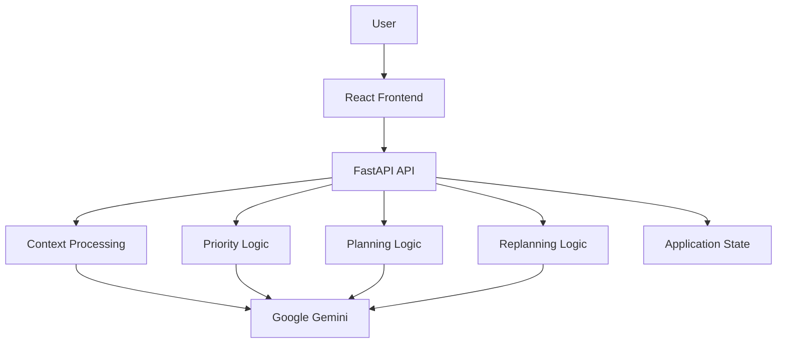

# 🧠 LifeOS

<p align="center">
  
</p>

<p align="center">
  
  
  
</p>

<p align="center">
  
</p>

<p align="center">
  <strong>Give LifeOS your messy information. It tells you what matters and what to do next.</strong>
</p>

<p align="center">
  <a href="https://adaptive-action.vercel.app/">🌐 Live Demo</a>
  •
  <a href="#-how-lifeos-works">How It Works</a>
  •
  <a href="#-roadmap">Roadmap</a>
</p>

---

# 🌌 What Is LifeOS?

**LifeOS** is an AI-powered personal action system that transforms messy, unstructured information into clear priorities, realistic plans, and a **single next action**.

Most productivity tools help users answer:

> **"What do I have to do?"**

LifeOS focuses on a different question:

> **"What should I do next?"**

The difference is important.

People already have information everywhere:

* Notes
* Assignments
* Deadlines
* Goals
* Study material
* Projects
* Ideas
* Tasks
* Work requirements

The difficult part is deciding:

* What matters most?
* What should I start with?
* How much time should I spend on it?
* Can everything fit into the available time?
* What happens if my plan changes?

LifeOS is designed to act as a **decision layer between information and action**.

---

# 🎯 The Problem

Information overload is rarely caused by a lack of productivity tools.

The real problem is **decision overload**.

A typical user might have:

```text
ML Exam
Web Assignment
Project
Meeting
Deadline
Study Material
Ideas
Personal Goals
```

A traditional task manager can store all of these.

But the user still has to decide:

```text
What first?
      ↓
Why this task?
      ↓
How long?
      ↓
Can it fit today?
      ↓
What if something takes longer?
```

That repeated decision-making creates friction.

### LifeOS focuses on reducing that friction.

---

# ⚡ The Core Idea

LifeOS transforms:

```text
MESSY INFORMATION
        ↓
UNDERSTAND
        ↓
PRIORITIZE
        ↓
PLAN
        ↓
NEXT ACTION
        ↓
ACT
        ↓
ADAPT
```

The system is designed around a continuous action loop rather than a static list of tasks.

```text
Information
     ↓
Context
     ↓
Priority
     ↓
Plan
     ↓
Next Action
     ↓
User Action
     ↓
New Reality
     ↓
Replanning
     ↓
New Next Action
```

The final step is what makes LifeOS different.

**The plan is not treated as permanent.**

---

# 🧠 How LifeOS Works

## 01 — Capture

The user provides information in natural language.

Example:

```text
I have an ML exam Friday.

I need to study Naive Bayes,
Linear Regression and Candidate Elimination.

My web assignment is due tomorrow
and it is 60% complete.

I have 3 hours tonight.
```

The user does not need to manually create a complicated task structure first.

---

## 02 — Understand

LifeOS analyzes the information and identifies useful context.

For example:

```text
GOAL
Prepare for ML exam

TASKS
Study Naive Bayes
Study Linear Regression
Study Candidate Elimination
Complete Web Assignment

DEADLINES
Web Assignment → Tomorrow
ML Exam → Friday

PROGRESS
Web Assignment → 60% complete

AVAILABLE TIME
3 Hours
```

The purpose of this stage is to turn unstructured information into actionable context.

---

# 🎯 03 — Prioritize

LifeOS evaluates tasks using multiple signals.

These can include:

* Deadline proximity
* Urgency
* Importance
* Estimated effort
* Current progress
* Dependencies
* Available time
* Goal alignment

Instead of simply sorting tasks by creation date, LifeOS attempts to determine which task deserves attention **right now**.

Example:

```text
1. Complete Web Assignment
2. Study Naive Bayes
3. Study Linear Regression
4. Study Candidate Elimination
```

The exact priority depends on the context provided by the user.

---

# ⚡ 04 — Next Best Action

The central idea of LifeOS is the **Next Action**.

Instead of presenting the user with another overwhelming task list, LifeOS identifies the action that should happen next.

Example:

```text
┌──────────────────────────────────────┐
│             NEXT ACTION              │
│                                      │
│      Complete Web Assignment         │
│                                      │
│      Priority: HIGH                  │
│      Estimated Time: 45 minutes      │
│                                      │
│      WHY THIS ACTION?                │
│                                      │
│      • Deadline is tomorrow          │
│      • Already 60% complete          │
│      • High urgency                  │
│      • Completing it reduces         │
│        immediate deadline pressure   │
│                                      │
│             [ START ]                │
└──────────────────────────────────────┘
```

The objective is simple:

> **Reduce decision fatigue and help the user start.**

---

# 📅 05 — Action Planning

Once priorities are identified, LifeOS can turn them into an executable plan.

Example:

```text
TODAY

6:00 PM
Complete Web Assignment
45 min

6:45 PM
Break
15 min

7:00 PM
Study Naive Bayes
45 min

7:45 PM
Practice Questions
30 min

8:15 PM
Review
30 min
```

Planning considers factors such as:

* Available time
* Task duration
* Deadlines
* Priority
* Dependencies
* Existing progress
* Breaks

The objective is not to create the most impressive-looking calendar.

The objective is to create a plan that can realistically be executed.

---

# 🔄 06 — Adaptive Replanning

Real life does not follow perfect schedules.

Suppose the original plan is:

```text
Chapter 1
Chapter 2
Assignment
```

But the user spends longer than expected on the assignment.

LifeOS can respond to the changed situation.

```text
Changed Reality
       ↓
Remaining Work
       ↓
Deadlines
       ↓
Recalculate Priorities
       ↓
Adjust Plan
       ↓
Generate New Next Action
```

For example:

> The assignment is now taking longer than expected, so lower-priority study work can be moved while protecting the closer deadline.

This is the core adaptive behavior LifeOS is designed to demonstrate.

---

# 💡 Why LifeOS Is Different

LifeOS is not intended to be:

```text
Another To-Do List
Another Notes App
Another Calendar
Another Chatbot
```

Instead:

```text
Information
     ↓
Decision
     ↓
Action
     ↓
Adaptation
```

The product focuses on helping users move from **knowing** to **doing**.

---

# 🧪 Example End-to-End Scenario

### User Input

```text
I have an ML exam Friday.

My web assignment is due tomorrow
and is 60% complete.

I have 3 hours tonight.

I still need to study:
- Naive Bayes
- Linear Regression
- Candidate Elimination
```

### LifeOS Understands

```text
Exam → Friday
Assignment → Tomorrow
Assignment Progress → 60%
Available Time → 3 hours
```

### LifeOS Prioritizes

```text
HIGH
Complete Web Assignment

MEDIUM
Study Naive Bayes

MEDIUM
Study Linear Regression

MEDIUM
Study Candidate Elimination
```

### LifeOS Plans

```text
Complete Assignment → 90 min
Naive Bayes → 45 min
Practice → 30 min
Review → 15 min
```

### LifeOS Recommends

```text
NEXT ACTION

Complete the Web Assignment.
```

### Reality Changes

The assignment takes longer than expected.

```text
Expected → 45 minutes
Actual → 90 minutes
```

### LifeOS Adapts

```text
Recalculate remaining workload
          ↓
Protect closest deadline
          ↓
Move lower-priority work
          ↓
Update plan
          ↓
Generate new Next Action
```

This is the behavior LifeOS is designed to showcase.

---

# 🏗️ System Architecture



The architecture is intentionally centered around the action pipeline:

```text
Context
   ↓
Priority
   ↓
Planning
   ↓
Action
   ↓
Replanning
```

---

# 🤖 AI Role

Gemini is used where language understanding and reasoning provide meaningful value.

### AI can help with:

* Understanding natural-language context
* Extracting tasks
* Detecting goals
* Identifying deadlines
* Interpreting progress
* Generating explanations
* Supporting action recommendations

The application should not use AI simply because an AI API is available.

The AI must contribute to the actual decision-making workflow.

---

# ⚙️ Deterministic Decision Logic

Not every decision needs an LLM.

LifeOS can combine AI understanding with deterministic application logic.

For example:

```text
AI
 ↓
Extract structured context
 ↓
Deterministic priority signals
 ↓
Planning constraints
 ↓
Action recommendation
```

This hybrid approach makes the system more predictable and easier to explain.

---

# 🔍 Explainable Decisions

LifeOS should not simply tell the user:

> **"Do this."**

It should also answer:

> **"Why this?"**

Example:

```text
WHY THIS ACTION?

✓ Closest deadline
✓ High urgency
✓ Already partially completed
✓ Fits available time
✓ Reduces immediate deadline pressure
```

Explainability is an important part of the product experience.

---

# 🎨 Product Design

LifeOS uses a premium dark interface designed around focus and action.

### Current Visual Direction

```text
MIDNIGHT BACKGROUND
        +
WARM AMBER
        +
ORANGE HIGHLIGHTS
        +
BURGUNDY / DEEP RED
        +
SOFT GLOW
        +
GLASS-LIKE SURFACES
        +
SUBTLE MOTION
```

The visual language intentionally moves away from conventional productivity dashboards.

The interface should feel like an **AI decision system**, not a spreadsheet.

---

# 🖥️ User Experience Principles

LifeOS follows several UI principles:

### 1. One Clear Decision

The user should quickly understand:

> **What should I do now?**

### 2. Strong Hierarchy

Important information should visually dominate secondary information.

### 3. Explain AI Decisions

Recommendations should have understandable reasoning.

### 4. Reduce Cognitive Load

The interface should not make users manage unnecessary configuration.

### 5. Action Over Information

Every major screen should move the user closer to completing something.

### 6. Adapt Instead of Blame

When plans fail, LifeOS should update the plan instead of treating the missed task as the end of the workflow.

---

# 🌐 Current Application

**Live Demo:**

https://adaptive-action.vercel.app/

The deployed application currently focuses on communicating the core LifeOS concept:

```text
AI Action System
        ↓
Information
        ↓
Decision
        ↓
Next Action
        ↓
Adaptive Replanning
```

The MVP is intentionally focused rather than attempting to implement every possible productivity feature.

---

# 🛠️ Technology Stack

| Layer           | Technology    |
| --------------- | ------------- |
| Frontend        | React         |
| Language        | TypeScript    |
| Build Tool      | Vite          |
| Styling         | Tailwind CSS  |
| UI Components   | shadcn/ui     |
| Backend         | Python        |
| API             | FastAPI       |
| AI              | Google Gemini |
| Version Control | Git + GitHub  |
| Deployment      | Vercel        |

> The stack may evolve as the application develops.

---

# 📂 Project Structure

```text
lifeos/
│
├── frontend/
│   ├── src/
│   │   ├── components/
│   │   ├── pages/
│   │   ├── hooks/
│   │   ├── lib/
│   │   └── types/
│   │
│   ├── package.json
│   └── vite.config.ts
│
├── backend/
│   ├── app/
│   │   ├── agents/
│   │   ├── models/
│   │   ├── routes/
│   │   ├── schemas/
│   │   ├── services/
│   │   └── utils/
│   │
│   ├── requirements.txt
│   └── ...
│
├── .env.example
├── .gitignore
└── README.md
```

---

# ⚙️ Run Locally

## Clone the Repository

```bash
git clone YOUR_REPOSITORY_URL
cd lifeos
```

## Start the Frontend

```bash
cd frontend
npm install
npm run dev
```

## Start the Backend

Open another terminal:

```bash
cd backend
python -m venv venv
```

### Windows

```bash
venv\Scripts\activate
```

Install dependencies:

```bash
pip install -r requirements.txt
```

Start FastAPI:

```bash
uvicorn app.main:app --reload
```

---

# 🔐 Environment Variables

Create a `.env` file in the backend.

```env
GEMINI_API_KEY=your_gemini_api_key
DATABASE_URL=your_database_url
FRONTEND_URL=your_frontend_url
```

Never commit API keys or other secrets to GitHub.

Use `.env.example` to document required configuration.

---

# 🔌 API

The application API is evolving alongside the MVP.

Current/planned endpoint structure includes:

```text
POST   /context
POST   /documents
POST   /analyze
POST   /plan

GET    /tasks
POST   /tasks
PATCH  /tasks/{id}

POST   /feedback
POST   /replan

GET    /dashboard
```

Endpoints should only be considered production-ready when implemented and tested in the deployed system.

---

# 🧪 Testing Strategy

The core workflow should be tested against:

```text
[ ] Natural-language context
[ ] Task extraction
[ ] Goal extraction
[ ] Deadline detection
[ ] Priority calculation
[ ] Time-aware planning
[ ] Next Action generation
[ ] Task completion
[ ] Delayed tasks
[ ] Replanning
[ ] Invalid input
[ ] AI failure
[ ] Large input
[ ] API errors
[ ] Responsive layout
[ ] Mobile layout
```

Special attention should be given to the adaptive workflow:

```text
PLAN
 ↓
ACTION
 ↓
CHANGE
 ↓
REPLAN
 ↓
NEW ACTION
```

---

# 🛣️ Roadmap

## 🟢 Phase 1 — Product Foundation

* [x] Product concept
* [x] Problem definition
* [x] Core workflow
* [x] MVP direction
* [x] Technical architecture
* [x] Initial product UI
* [x] Public deployment

---

## 🔵 Phase 2 — Core Application

* [x] React frontend foundation
* [x] FastAPI backend foundation
* [x] Context analysis workflow
* [x] Action-oriented dashboard
* [x] Planning workflow
* [ ] Authentication
* [ ] Persistent user accounts
* [ ] Production database integration

---

## 🧠 Phase 3 — AI Context Intelligence

* [x] Gemini integration
* [x] Structured AI responses
* [x] Context understanding
* [x] Task extraction
* [x] Goal extraction
* [x] Deadline extraction
* [ ] Rich document understanding
* [ ] Multi-source context

---

## ⚡ Phase 4 — Action Intelligence

* [x] Priority reasoning
* [x] Next Best Action
* [x] Time-aware planning
* [x] Explainable recommendations
* [ ] More advanced dependency reasoning
* [ ] Improved effort estimation
* [ ] Personalized prioritization

---

## 🔄 Phase 5 — Adaptive Intelligence

* [x] Task completion workflow
* [x] Plan updates
* [ ] Rich user feedback
* [ ] Missed-task detection
* [ ] Plan effectiveness evaluation
* [ ] Automated adaptive replanning
* [ ] Personalized planning behavior

---

## 🏆 Phase 6 — Hackathon Demo

* [x] End-to-end product concept
* [x] Student scenario
* [x] Next Action demonstration
* [ ] Complete adaptive replanning demonstration
* [ ] Real-world testing
* [ ] Demo recording
* [ ] Final presentation
* [ ] Final submission

---

## 🚀 Phase 7 — Future Product

Potential future capabilities:

```text
Google Calendar
Gmail
Google Drive
GitHub
Notion
Slack
Voice Input
Browser Extension
Mobile Application
```

These integrations are **future scope** and are not required for the core MVP.

---

# 🏆 AI Builders Hackathon 2026

LifeOS is being developed for the **AI Builders Hackathon 2026**.

The project demonstrates a different approach to AI applications.

Instead of:

```text
USER
 ↓
QUESTION
 ↓
AI ANSWER
```

LifeOS aims for:

```text
USER
 ↓
MESSY INFORMATION
 ↓
AI UNDERSTANDS
 ↓
SYSTEM PRIORITIZES
 ↓
SYSTEM PLANS
 ↓
NEXT ACTION
 ↓
USER ACTS
 ↓
REALITY CHANGES
 ↓
SYSTEM ADAPTS
```

The goal is to demonstrate that AI can participate in an ongoing **decision and action loop**, rather than simply generating text.

---

# 🎬 The Killer Demo

The ideal LifeOS demonstration is simple:

### 1. Give LifeOS messy information

```text
Exam Friday.
Assignment tomorrow.
Assignment 60% complete.
Limited time tonight.
```

### 2. LifeOS understands the situation

```text
Tasks
Goals
Deadlines
Progress
Available time
```

### 3. LifeOS prioritizes

```text
Complete Assignment
```

### 4. LifeOS generates a plan

```text
Assignment
        ↓
Study
        ↓
Practice
        ↓
Review
```

### 5. LifeOS gives one Next Action

```text
Complete the assignment.
```

### 6. Change reality

```text
The assignment takes longer than expected.
```

### 7. LifeOS adapts

```text
Detect change
      ↓
Recalculate
      ↓
Protect deadline
      ↓
Move lower-priority work
      ↓
Generate new plan
```

### 8. New Next Action

```text
Continue with the highest-value remaining task.
```

The important thing is not that LifeOS creates a beautiful schedule.

The important thing is that **the system responds when reality changes.**

---

# 📈 Success Metrics

Future evaluation can measure:

* Time required to create a plan
* Time required to decide what to do next
* Task completion rate
* Missed deadline rate
* Priority recommendation accuracy
* Replanning success
* User satisfaction
* Plan adherence

Any published performance numbers will be based on actual testing.

**No fabricated results.**

---

# 🔮 Future Vision

The long-term vision for LifeOS is a continuously updated personal action layer.

Instead of requiring users to manually enter every piece of information, LifeOS could eventually understand information from multiple sources:

```text
Email
  +
Calendar
  +
Documents
  +
Tasks
  +
Projects
  +
Notes
  +
Goals
       ↓
  LIFEOS CONTEXT
       ↓
 PRIORITIZATION
       ↓
 ACTION
       ↓
 ADAPTATION
```

The goal is not to replace every application.

The goal is to sit above them and answer:

> **"Given everything happening right now, what should I do next?"**

---

# 📌 Product Principles

### Rule 01 — Action Over Features

Do not build features simply because they are technically impressive.

### Rule 02 — AI Must Matter

AI should perform meaningful work in the product.

### Rule 03 — Reduce Decision Fatigue

The system should make starting easier.

### Rule 04 — Explain Recommendations

Users should understand why an action was recommended.

### Rule 05 — Adapt to Reality

A plan should be able to change when circumstances change.

### Rule 06 — Focus the MVP

A small working action loop is more valuable than dozens of unfinished features.

### Rule 07 — Never Fake Results

All performance claims must come from actual testing.

---

# 🎯 The Product Principle

```text
        INFORMATION
             ↓
          CONTEXT
             ↓
          DECISION
             ↓
           ACTION
             ↓
         PROGRESS
             ↓
         ADAPTATION
             ↓
        NEW ACTION
```

LifeOS is not another place to store everything.

It is designed to become the decision layer between:

> **What is happening**

and

> **What you should do next.**

---

# 👨‍💻 Built By

<p align="center">

## Dhanush

**CSE — Data Science**

AI/ML • Data Science • Full-Stack Development

</p>

---

# ⭐ Support

If you find LifeOS interesting, consider giving the repository a ⭐ Star.

Your support helps the project continue evolving.

---

# 📜 License

This project is developed for educational, experimental, portfolio, and hackathon purposes.

---

<p align="center">

## 🧠 LifeOS

### Turn information into action.

**Understand. Prioritize. Plan. Act. Adapt.**

</p>

<p align="center">
  
</p>
